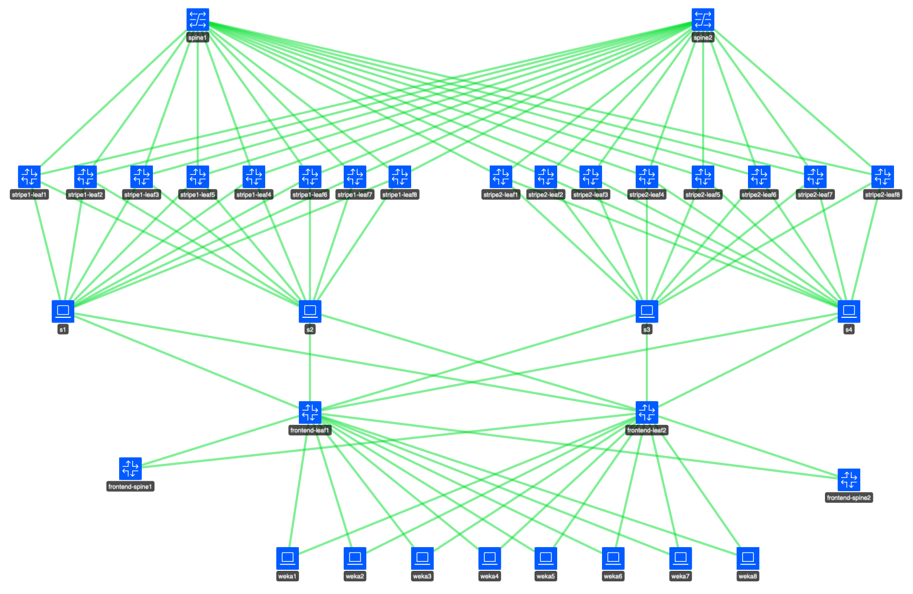
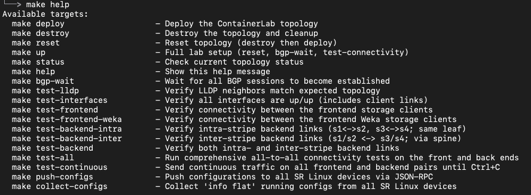
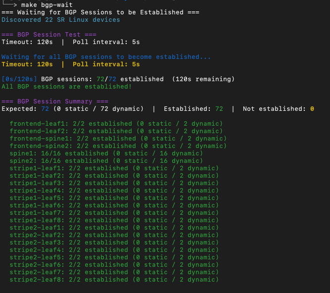
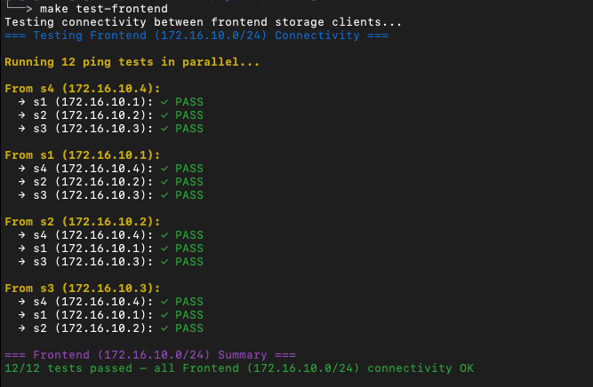
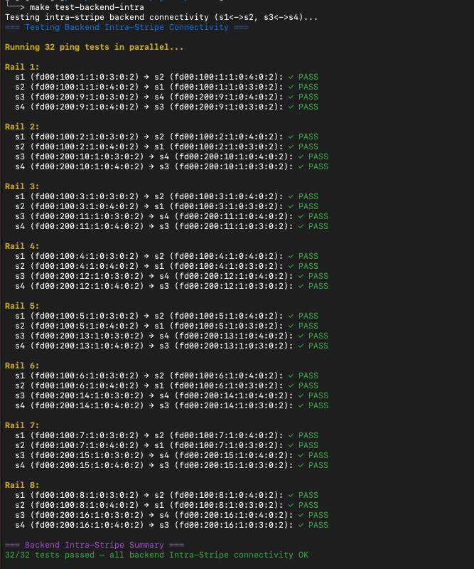
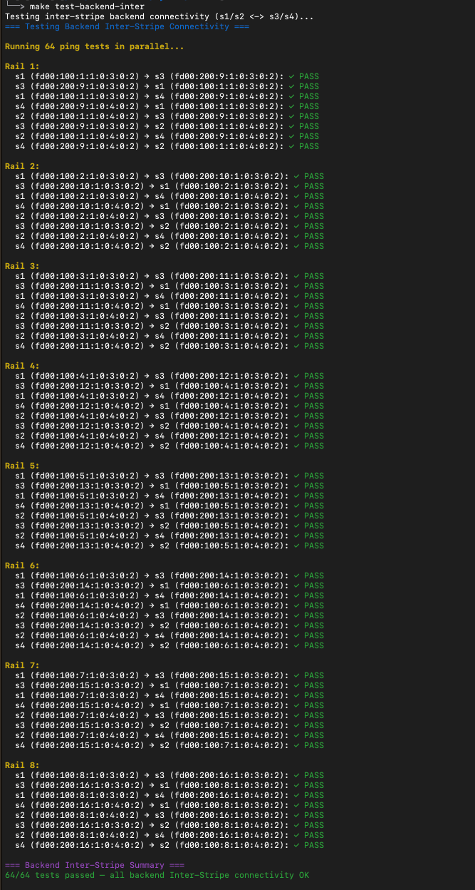
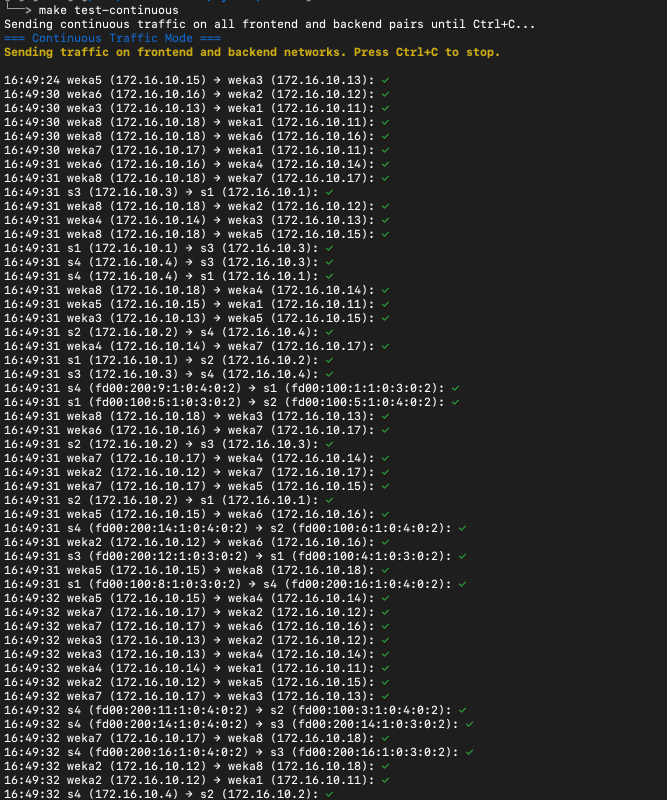
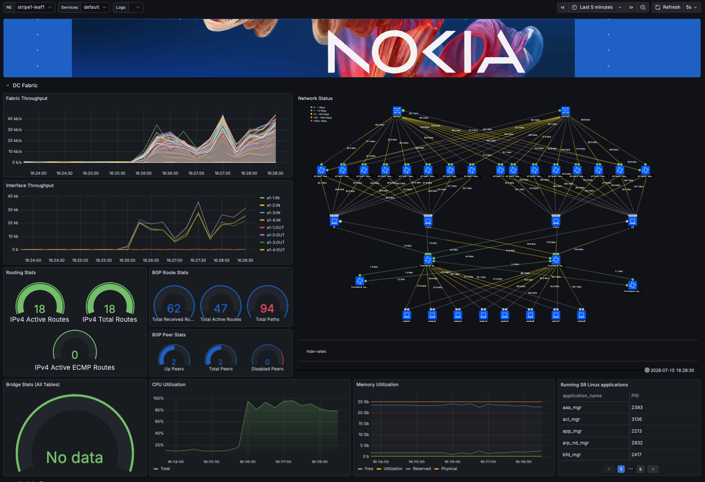

 # DRAFT -- WORK IN PROGRESS
 ## AI NVD with a two-stripe rail-optimized design  
 

  

# Getting Started

This containerlab is a virtual version of two-stripe rail-optimized frontend and backend AI fabrics as described in the Nokia Validated Design. It is comprised of containerized versions of varios 7220 IXR platforms:
- Backend Spines : 7220 IXR-H4
- Backend Leafs (Stripe1) : 7220 IXR-H4
- Backend Leafs (Stripe2) : 7220 IXR-H5-64d
- Frontend Spines : 7220 IXR-H5-64o
- Frontend Leafs : 7220 IXR-D5

All nodes are running release 25.10.1 as noted in the aifab.clab.yaml file that defines the topology. Additionally, there are lightweight Ubuntu Linux clients that are used in place of compute and storage devices, and are intended to be used as needed for testing connectivity through the fabrics.

If changes are required in terms of the SRL release, or the platforms being tested, that can be easily accomplished by changing the aifab.clab.yaml file. If a different release is specified it will be automatically downloaded from the public repo and installed as a docker image when the lab is deployed. 

Please refer to the containerlab documentation (https://containerlab.dev/) for complete details on installing containerlab, as well as starting a lab and accessing the nodes. 

There is an included make file that is intended to be used as a command orchestrator. It can be used to maintain the lab lifecycle (i.e. deploy, destroy and status - which are the functional equivalent of native containerlab commands), but it is not required. Its primary function is to execute bash scripts that were written to validate the functional health of the topology by validating the status of the interfaces and bgp peers, as well as for testing connectivity between compute and storage devices. These scripts can also be executed manually if desired. 

This lab includes the integration of a telemetry stack (gNMIC, Prometheus, Loki and Grafana) and there are some basic instructions for customizing these components later in this document. One important note is that a custom docker image may be required for Grafana depending on the environment. The related dockerfile can be found in the ./docker folder. Please refer to the Phase 2 section for additional details

Note that this entire lab running in a Debian/Ubuntu environment will consume ~12-13GB or RAM. 

## Nokia SRL Resources and References

- Get Started: https://learn.srlinux.dev                               
- Docs:        https://doc.srlinux.dev/25-10                   
- Release Notes:  https://doc.srlinux.dev/rn25-10-2               
- YANG Models:        https://yang.srlinux.dev/v25.10.2               
- Discord:     https://go.srlinux.dev/discord 
- Containerlab: https://containerlab.dev/                 
- Contact:     https://go.srlinux.dev/contact-sales
- NVDs: https://documentation.nokia.com/networks-design-hub/index.html   

# Lab Topology

  

## Lab Configuration Overview

This AI NVD covers the following features:

- IPv6 fabric connectivity using link-local addressing and dynamic BGP Neighbors
- Leaf-GPU IPv6 connectivity
- Dynamic Load Balancing (DLB)
- DCQCN (ECN + PFC) for congestion control

# Phase 1: Lab Initialization

Once containerlab has been installed (https://containerlab.dev/), the lab is ready to be deployed. It is controlled/defined by the aifab.clab.yaml file. During the initial deployment, any required images will be downloaded automatically and installed as Docker images. 

*Note that for this initial Phase 1 deployment, it may be desireable to comment out the telemetry stack in the yaml file, and simply bring up the network and linux devices for basic validation.*

The lab can be deployed using the standard containerlab method, or by using the included make file which functions as a command orchestrator

<pre style="background-color: #f4f4f4; border: 1px solid #ddd; padding: 10px; border-radius: 5px;">
└──> make help
Available targets:
  make deploy                   - Deploy the ContainerLab topology
  make destroy                  - Destroy the topology and cleanup
  make reset                    - Reset topology (destroy then deploy)
  make up                       - Full lab setup (reset, bgp-wait, test-connectivity)
  make status                   - Check current topology status
  make help                     - Show this help message
  make bgp-wait                 - Wait for all BGP sessions to become established
  make test-lldp                - Verify LLDP neighbors match expected topology
  make test-interfaces          - Verify all interfaces are up/up (includes client links)
  make test-frontend            - Verify connectivity between the frontend storage clients
  make test-frontend-weka       - Verify connectivity between the frontend Weka storage clients
  make test-backend-intra       - Verify intra-stripe backend links (s1<->s2, s3<->s4; same leaf)
  make test-backend-inter       - Verify inter-stripe backend links (s1/s2 <-> s3/s4; via spine)
  make test-backend             - Verify both intra- and inter-stripe backend links
  make test-all                 - Run comprehensive all-to-all connectivity tests on the front and back ends
  make test-continuous          - Send continuous traffic on all frontend and backend pairs until Ctrl+C
  make push-configs             - Push configurations to all SR Linux devices via JSON-RPC
</pre>

## Deploying the Lab

<pre style="background-color: #f4f4f4; border: 1px solid #ddd; padding: 10px; border-radius: 5px;">
└──> make deploy
containerlab deploy -t aifab.clab.yaml --reconfigure
16:32:47 INFO Containerlab started version=0.77.0
16:32:47 INFO Parsing & checking topology file=aifab.clab.yaml
16:32:47 INFO Removing directory path=/etc/containerlab/mylabs/AI-NVD/clab-aifab
16:32:47 INFO Creating docker network name=mgmt IPv4 subnet=172.21.21.0/24 IPv6 subnet="" MTU=0
16:32:47 INFO Creating lab directory path=/etc/containerlab/mylabs/AI-NVD/clab-aifab
16:32:47 INFO unable to adjust Labdir file ACLs: operation not supported
16:32:47 INFO Creating container name=s1
16:32:47 INFO Creating container name=weka2
16:32:47 INFO Creating container name=promtail
16:32:47 INFO Creating container name=grafana
16:32:47 INFO Creating container name=s3
16:32:47 INFO Creating container name=weka6
16:32:47 INFO Creating container name=s4
16:32:47 INFO Creating container name=stripe2-leaf8
16:32:47 INFO Creating container name=frontend-leaf2
16:32:47 INFO Creating container name=spine1
16:32:47 INFO Creating container name=stripe1-leaf4
16:32:47 INFO Creating container name=spine2
16:32:47 INFO Creating container name=frontend-leaf1
16:32:47 INFO Creating container name=stripe2-leaf1
16:32:48 INFO Running postdeploy actions kind=nokia_srlinux node=stripe2-leaf1
16:32:48 INFO Created link: s3:eth1 ▪┄┄▪ stripe2-leaf1:e1-3
16:32:48 INFO Creating container name=weka3
16:32:48 INFO Created link: s4:eth1 ▪┄┄▪ stripe2-leaf1:e1-4
16:32:48 INFO Created link: s1:eth4 ▪┄┄▪ stripe1-leaf4:e1-3
16:32:48 INFO Running postdeploy actions kind=nokia_srlinux node=stripe1-leaf4
16:32:48 INFO Created link: s1:eth9 ▪┄┄▪ frontend-leaf1:e1-3
16:32:49 INFO Creating container name=loki
16:32:49 INFO Created link: s3:eth8 ▪┄┄▪ stripe2-leaf8:e1-3
16:32:49 INFO Created link: s3:eth9 ▪┄┄▪ frontend-leaf1:e1-5
16:32:49 INFO Running postdeploy actions kind=nokia_srlinux node=stripe2-leaf8
16:32:49 INFO Created link: s4:eth8 ▪┄┄▪ stripe2-leaf8:e1-4
16:32:50 INFO Created link: weka2:eth1 ▪┄┄▪ frontend-leaf1:e1-8
16:32:50 INFO Created link: s1:eth10 ▪┄┄▪ frontend-leaf2:e1-3
16:32:50 INFO Created link: s4:eth9 ▪┄┄▪ frontend-leaf1:e1-6
16:32:50 INFO Created link: weka3:eth1 ▪┄┄▪ frontend-leaf1:e1-9
16:32:50 INFO Created link: weka6:eth1 ▪┄┄▪ frontend-leaf1:e1-12
16:32:50 INFO Created link: stripe1-leaf4:e1-1 ▪┄┄▪ spine1:e1-4
16:32:50 INFO Created link: s3:eth10 ▪┄┄▪ frontend-leaf2:e1-5
16:32:50 INFO Created link: s4:eth10 ▪┄┄▪ frontend-leaf2:e1-6
16:32:50 INFO Running postdeploy actions kind=nokia_srlinux node=frontend-leaf1
16:32:50 INFO Creating container name=prometheus
16:32:50 INFO Created link: weka2:eth2 ▪┄┄▪ frontend-leaf2:e1-8
16:32:50 INFO Created link: stripe1-leaf4:e1-2 ▪┄┄▪ spine2:e1-4
16:32:50 INFO Creating container name=stripe1-leaf7
16:32:50 INFO Creating container name=stripe2-leaf7
16:32:50 INFO Created link: weka3:eth2 ▪┄┄▪ frontend-leaf2:e1-9
16:32:50 INFO Created link: stripe2-leaf1:e1-1 ▪┄┄▪ spine1:e1-9
16:32:51 INFO Created link: weka6:eth2 ▪┄┄▪ frontend-leaf2:e1-12
16:32:51 INFO Created link: stripe2-leaf1:e1-2 ▪┄┄▪ spine2:e1-9
16:32:51 INFO Creating container name=weka4
16:32:51 INFO Running postdeploy actions kind=nokia_srlinux node=frontend-leaf2
16:32:51 INFO Created link: stripe2-leaf8:e1-1 ▪┄┄▪ spine1:e1-16
16:32:51 INFO Running postdeploy actions kind=nokia_srlinux node=spine1
16:32:51 INFO Created link: stripe2-leaf8:e1-2 ▪┄┄▪ spine2:e1-16
16:32:51 INFO Running postdeploy actions kind=nokia_srlinux node=spine2
16:32:51 INFO Created link: stripe1-leaf7:e1-1 ▪┄┄▪ spine1:e1-7
16:32:51 INFO Created link: stripe1-leaf7:e1-2 ▪┄┄▪ spine2:e1-7
16:32:51 INFO Creating container name=stripe2-leaf4
16:32:51 INFO Created link: s1:eth7 ▪┄┄▪ stripe1-leaf7:e1-3
16:32:51 INFO Created link: stripe2-leaf7:e1-1 ▪┄┄▪ spine1:e1-15
16:32:52 INFO Running postdeploy actions kind=nokia_srlinux node=stripe1-leaf7
16:32:52 INFO Created link: stripe2-leaf7:e1-2 ▪┄┄▪ spine2:e1-15
16:32:52 INFO Created link: s3:eth7 ▪┄┄▪ stripe2-leaf7:e1-3
16:32:52 INFO Created link: s4:eth7 ▪┄┄▪ stripe2-leaf7:e1-4
16:32:52 INFO Running postdeploy actions kind=nokia_srlinux node=stripe2-leaf7
16:32:52 INFO Created link: weka4:eth1 ▪┄┄▪ frontend-leaf1:e1-10
16:32:52 INFO Created link: weka4:eth2 ▪┄┄▪ frontend-leaf2:e1-10
16:32:52 INFO Creating container name=s2
16:32:52 INFO Created link: stripe2-leaf4:e1-1 ▪┄┄▪ spine1:e1-12
16:32:52 INFO Created link: stripe2-leaf4:e1-2 ▪┄┄▪ spine2:e1-12
16:32:52 INFO Created link: s3:eth4 ▪┄┄▪ stripe2-leaf4:e1-3
16:32:53 INFO Created link: s4:eth4 ▪┄┄▪ stripe2-leaf4:e1-4
16:32:53 INFO Running postdeploy actions kind=nokia_srlinux node=stripe2-leaf4
16:32:54 INFO Created link: s2:eth4 ▪┄┄▪ stripe1-leaf4:e1-4
16:32:54 INFO Created link: s2:eth7 ▪┄┄▪ stripe1-leaf7:e1-4
16:32:54 INFO Created link: s2:eth9 ▪┄┄▪ frontend-leaf1:e1-4
16:32:54 INFO Created link: s2:eth10 ▪┄┄▪ frontend-leaf2:e1-4
16:33:26 INFO Creating container name=stripe1-leaf8
16:33:27 INFO Creating container name=weka7
16:33:27 INFO Creating container name=stripe1-leaf6
16:33:28 INFO Created link: stripe1-leaf8:e1-1 ▪┄┄▪ spine1:e1-8
16:33:28 INFO Created link: stripe1-leaf8:e1-2 ▪┄┄▪ spine2:e1-8
16:33:28 INFO Created link: s1:eth8 ▪┄┄▪ stripe1-leaf8:e1-3
16:33:28 INFO Created link: weka7:eth1 ▪┄┄▪ frontend-leaf1:e1-13
16:33:28 INFO Created link: weka7:eth2 ▪┄┄▪ frontend-leaf2:e1-13
16:33:28 INFO Created link: s2:eth8 ▪┄┄▪ stripe1-leaf8:e1-4
16:33:28 INFO Running postdeploy actions kind=nokia_srlinux node=stripe1-leaf8
16:33:29 INFO Created link: stripe1-leaf6:e1-1 ▪┄┄▪ spine1:e1-6
16:33:29 INFO Creating container name=stripe1-leaf2
16:33:29 INFO Created link: stripe1-leaf6:e1-2 ▪┄┄▪ spine2:e1-6
16:33:29 INFO Created link: s1:eth6 ▪┄┄▪ stripe1-leaf6:e1-3
16:33:29 INFO Created link: s2:eth6 ▪┄┄▪ stripe1-leaf6:e1-4
16:33:29 INFO Running postdeploy actions kind=nokia_srlinux node=stripe1-leaf6
16:33:29 INFO Creating container name=stripe2-leaf6
16:33:30 INFO Creating container name=frontend-spine2
16:33:31 INFO Created link: stripe1-leaf2:e1-1 ▪┄┄▪ spine1:e1-2
16:33:31 INFO Created link: stripe2-leaf6:e1-1 ▪┄┄▪ spine1:e1-14
16:33:31 INFO Created link: stripe1-leaf2:e1-2 ▪┄┄▪ spine2:e1-2
16:33:31 INFO Created link: s1:eth2 ▪┄┄▪ stripe1-leaf2:e1-3
16:33:31 INFO Created link: stripe2-leaf6:e1-2 ▪┄┄▪ spine2:e1-14
16:33:31 INFO Created link: s3:eth6 ▪┄┄▪ stripe2-leaf6:e1-3
16:33:31 INFO Created link: s2:eth2 ▪┄┄▪ stripe1-leaf2:e1-4
16:33:31 INFO Running postdeploy actions kind=nokia_srlinux node=stripe1-leaf2
16:33:31 INFO Created link: s4:eth6 ▪┄┄▪ stripe2-leaf6:e1-4
16:33:31 INFO Running postdeploy actions kind=nokia_srlinux node=stripe2-leaf6
16:33:32 INFO Creating container name=stripe1-leaf1
16:33:34 INFO Created link: frontend-leaf1:e1-2 ▪┄┄▪ frontend-spine2:e1-1
16:33:34 INFO Created link: frontend-leaf2:e1-2 ▪┄┄▪ frontend-spine2:e1-2
16:33:34 INFO Running postdeploy actions kind=nokia_srlinux node=frontend-spine2
16:33:35 INFO Created link: stripe1-leaf1:e1-1 ▪┄┄▪ spine1:e1-1
16:33:35 INFO Created link: stripe1-leaf1:e1-2 ▪┄┄▪ spine2:e1-1
16:33:35 INFO Created link: s1:eth1 ▪┄┄▪ stripe1-leaf1:e1-3
16:33:35 INFO Created link: s2:eth1 ▪┄┄▪ stripe1-leaf1:e1-4
16:33:35 INFO Running postdeploy actions kind=nokia_srlinux node=stripe1-leaf1
16:33:37 INFO Creating container name=weka5
16:33:37 INFO Creating container name=stripe1-leaf3
16:33:37 INFO Creating container name=frontend-spine1
16:33:38 INFO Created link: stripe1-leaf3:e1-1 ▪┄┄▪ spine1:e1-3
16:33:38 INFO Created link: stripe1-leaf3:e1-2 ▪┄┄▪ spine2:e1-3
16:33:38 INFO Created link: s1:eth3 ▪┄┄▪ stripe1-leaf3:e1-3
16:33:38 INFO Created link: s2:eth3 ▪┄┄▪ stripe1-leaf3:e1-4
16:33:38 INFO Running postdeploy actions kind=nokia_srlinux node=stripe1-leaf3
16:33:38 INFO Created link: weka5:eth1 ▪┄┄▪ frontend-leaf1:e1-11
16:33:38 INFO Created link: weka5:eth2 ▪┄┄▪ frontend-leaf2:e1-11
16:33:38 INFO Created link: frontend-leaf1:e1-1 ▪┄┄▪ frontend-spine1:e1-1
16:33:38 INFO Created link: frontend-leaf2:e1-1 ▪┄┄▪ frontend-spine1:e1-2
16:33:38 INFO Running postdeploy actions kind=nokia_srlinux node=frontend-spine1
16:33:38 INFO Creating container name=stripe2-leaf2
16:33:39 INFO Creating container name=stripe1-leaf5
16:33:41 INFO Created link: stripe2-leaf2:e1-1 ▪┄┄▪ spine1:e1-10
16:33:41 INFO Created link: stripe2-leaf2:e1-2 ▪┄┄▪ spine2:e1-10
16:33:41 INFO Created link: s3:eth2 ▪┄┄▪ stripe2-leaf2:e1-3
16:33:41 INFO Created link: s4:eth2 ▪┄┄▪ stripe2-leaf2:e1-4
16:33:41 INFO Running postdeploy actions kind=nokia_srlinux node=stripe2-leaf2
16:33:42 INFO Created link: stripe1-leaf5:e1-1 ▪┄┄▪ spine1:e1-5
16:33:42 INFO Created link: stripe1-leaf5:e1-2 ▪┄┄▪ spine2:e1-5
16:33:42 INFO Created link: s1:eth5 ▪┄┄▪ stripe1-leaf5:e1-3
16:33:42 INFO Created link: s2:eth5 ▪┄┄▪ stripe1-leaf5:e1-4
16:33:42 INFO Running postdeploy actions kind=nokia_srlinux node=stripe1-leaf5
16:34:19 INFO Creating container name=stripe2-leaf3
16:34:19 INFO Creating container name=stripe2-leaf5
16:34:20 INFO Creating container name=weka8
16:34:20 INFO Created link: stripe2-leaf5:e1-1 ▪┄┄▪ spine1:e1-13
16:34:20 INFO Created link: stripe2-leaf5:e1-2 ▪┄┄▪ spine2:e1-13
16:34:20 INFO Created link: s3:eth5 ▪┄┄▪ stripe2-leaf5:e1-3
16:34:20 INFO Created link: s4:eth5 ▪┄┄▪ stripe2-leaf5:e1-4
16:34:20 INFO Running postdeploy actions kind=nokia_srlinux node=stripe2-leaf5
16:34:21 INFO Created link: stripe2-leaf3:e1-1 ▪┄┄▪ spine1:e1-11
16:34:21 INFO Created link: stripe2-leaf3:e1-2 ▪┄┄▪ spine2:e1-11
16:34:21 INFO Created link: s3:eth3 ▪┄┄▪ stripe2-leaf3:e1-3
16:34:21 INFO Created link: s4:eth3 ▪┄┄▪ stripe2-leaf3:e1-4
16:34:21 INFO Running postdeploy actions kind=nokia_srlinux node=stripe2-leaf3
16:34:21 INFO Creating container name=weka1
16:34:21 INFO Creating container name=gnmic
16:34:22 INFO Created link: weka8:eth1 ▪┄┄▪ frontend-leaf1:e1-14
16:34:22 INFO Created link: weka8:eth2 ▪┄┄▪ frontend-leaf2:e1-14
16:34:22 INFO Created link: weka1:eth1 ▪┄┄▪ frontend-leaf1:e1-7
16:34:22 INFO Created link: weka1:eth2 ▪┄┄▪ frontend-leaf2:e1-7
16:35:34 INFO Executed command node=weka3 command="bash linux/weka3.sh" stdout=""
16:35:34 INFO Executed command node=weka7 command="bash linux/weka7.sh" stdout=""
16:35:34 INFO Executed command node=s3 command="bash linux/s3.sh" stdout=""
16:35:34 INFO Executed command node=s1 command="bash linux/s1.sh" stdout=""
16:35:34 INFO Executed command node=s4 command="bash linux/s4.sh" stdout=""
16:35:34 INFO Executed command node=weka1 command="bash linux/weka1.sh" stdout=""
16:35:34 INFO Executed command node=weka6 command="bash linux/weka6.sh" stdout=""
16:35:34 INFO Executed command node=weka2 command="bash linux/weka2.sh" stdout=""
16:35:34 INFO Executed command node=weka4 command="bash linux/weka4.sh" stdout=""
16:35:34 INFO Executed command node=weka5 command="bash linux/weka5.sh" stdout=""
16:35:34 INFO Executed command node=weka8 command="bash linux/weka8.sh" stdout=""
16:35:34 INFO Executed command node=s2 command="bash linux/s2.sh" stdout=""
16:35:34 INFO Adding host entries path=/etc/hosts
16:35:35 INFO Adding SSH config for nodes path=/etc/ssh/ssh_config.d/clab-aifab.conf
╭───────────────────────┬───────────────────────────────────────┬─────────┬────────────────╮
│          Name         │               Kind/Image              │  State  │ IPv4/6 Address │
├───────────────────────┼───────────────────────────────────────┼─────────┼────────────────┤
│ aifab-frontend-leaf1  │ nokia_srlinux                         │ running │ 172.21.21.33   │
│                       │ ghcr.io/nokia/srlinux:25.10.1         │         │ N/A            │
├───────────────────────┼───────────────────────────────────────┼─────────┼────────────────┤
│ aifab-frontend-leaf2  │ nokia_srlinux                         │ running │ 172.21.21.34   │
│                       │ ghcr.io/nokia/srlinux:25.10.1         │         │ N/A            │
├───────────────────────┼───────────────────────────────────────┼─────────┼────────────────┤
│ aifab-frontend-spine1 │ nokia_srlinux                         │ running │ 172.21.21.31   │
│                       │ ghcr.io/nokia/srlinux:25.10.1         │         │ N/A            │
├───────────────────────┼───────────────────────────────────────┼─────────┼────────────────┤
│ aifab-frontend-spine2 │ nokia_srlinux                         │ running │ 172.21.21.32   │
│                       │ ghcr.io/nokia/srlinux:25.10.1         │         │ N/A            │
├───────────────────────┼───────────────────────────────────────┼─────────┼────────────────┤
│ aifab-gnmic           │ linux                                 │ running │ 172.21.21.70   │
│                       │ ghcr.io/openconfig/gnmic:0.39.1       │         │ N/A            │
├───────────────────────┼───────────────────────────────────────┼─────────┼────────────────┤
│ aifab-grafana         │ linux                                 │ running │ 172.21.21.72   │
│                       │ grafana/grafana:12.3.2                │         │ N/A            │
├───────────────────────┼───────────────────────────────────────┼─────────┼────────────────┤
│ aifab-loki            │ linux                                 │ running │ 172.21.21.74   │
│                       │ grafana/loki:3.2.0                    │         │ N/A            │
├───────────────────────┼───────────────────────────────────────┼─────────┼────────────────┤
│ aifab-prometheus      │ linux                                 │ running │ 172.21.21.71   │
│                       │ quay.io/prometheus/prometheus:v2.54.1 │         │ N/A            │
├───────────────────────┼───────────────────────────────────────┼─────────┼────────────────┤
│ aifab-promtail        │ linux                                 │ running │ 172.21.21.73   │
│                       │ grafana/promtail:3.2.0                │         │ N/A            │
├───────────────────────┼───────────────────────────────────────┼─────────┼────────────────┤
│ aifab-s1              │ linux                                 │ running │ 172.21.21.51   │
│                       │ aninchat/ubuntu-server:v1             │         │ N/A            │
├───────────────────────┼───────────────────────────────────────┼─────────┼────────────────┤
│ aifab-s2              │ linux                                 │ running │ 172.21.21.52   │
│                       │ aninchat/ubuntu-server:v1             │         │ N/A            │
├───────────────────────┼───────────────────────────────────────┼─────────┼────────────────┤
│ aifab-s3              │ linux                                 │ running │ 172.21.21.53   │
│                       │ aninchat/ubuntu-server:v1             │         │ N/A            │
├───────────────────────┼───────────────────────────────────────┼─────────┼────────────────┤
│ aifab-s4              │ linux                                 │ running │ 172.21.21.54   │
│                       │ aninchat/ubuntu-server:v1             │         │ N/A            │
├───────────────────────┼───────────────────────────────────────┼─────────┼────────────────┤
│ aifab-spine1          │ nokia_srlinux                         │ running │ 172.21.21.101  │
│                       │ ghcr.io/nokia/srlinux:25.10.1         │         │ N/A            │
├───────────────────────┼───────────────────────────────────────┼─────────┼────────────────┤
│ aifab-spine2          │ nokia_srlinux                         │ running │ 172.21.21.102  │
│                       │ ghcr.io/nokia/srlinux:25.10.1         │         │ N/A            │
├───────────────────────┼───────────────────────────────────────┼─────────┼────────────────┤
│ aifab-stripe1-leaf1   │ nokia_srlinux                         │ running │ 172.21.21.11   │
│                       │ ghcr.io/nokia/srlinux:25.10.1         │         │ N/A            │
├───────────────────────┼───────────────────────────────────────┼─────────┼────────────────┤
│ aifab-stripe1-leaf2   │ nokia_srlinux                         │ running │ 172.21.21.12   │
│                       │ ghcr.io/nokia/srlinux:25.10.1         │         │ N/A            │
├───────────────────────┼───────────────────────────────────────┼─────────┼────────────────┤
│ aifab-stripe1-leaf3   │ nokia_srlinux                         │ running │ 172.21.21.13   │
│                       │ ghcr.io/nokia/srlinux:25.10.1         │         │ N/A            │
├───────────────────────┼───────────────────────────────────────┼─────────┼────────────────┤
│ aifab-stripe1-leaf4   │ nokia_srlinux                         │ running │ 172.21.21.14   │
│                       │ ghcr.io/nokia/srlinux:25.10.1         │         │ N/A            │
├───────────────────────┼───────────────────────────────────────┼─────────┼────────────────┤
│ aifab-stripe1-leaf5   │ nokia_srlinux                         │ running │ 172.21.21.15   │
│                       │ ghcr.io/nokia/srlinux:25.10.1         │         │ N/A            │
├───────────────────────┼───────────────────────────────────────┼─────────┼────────────────┤
│ aifab-stripe1-leaf6   │ nokia_srlinux                         │ running │ 172.21.21.16   │
│                       │ ghcr.io/nokia/srlinux:25.10.1         │         │ N/A            │
├───────────────────────┼───────────────────────────────────────┼─────────┼────────────────┤
│ aifab-stripe1-leaf7   │ nokia_srlinux                         │ running │ 172.21.21.17   │
│                       │ ghcr.io/nokia/srlinux:25.10.1         │         │ N/A            │
├───────────────────────┼───────────────────────────────────────┼─────────┼────────────────┤
│ aifab-stripe1-leaf8   │ nokia_srlinux                         │ running │ 172.21.21.18   │
│                       │ ghcr.io/nokia/srlinux:25.10.1         │         │ N/A            │
├───────────────────────┼───────────────────────────────────────┼─────────┼────────────────┤
│ aifab-stripe2-leaf1   │ nokia_srlinux                         │ running │ 172.21.21.21   │
│                       │ ghcr.io/nokia/srlinux:25.10.1         │         │ N/A            │
├───────────────────────┼───────────────────────────────────────┼─────────┼────────────────┤
│ aifab-stripe2-leaf2   │ nokia_srlinux                         │ running │ 172.21.21.22   │
│                       │ ghcr.io/nokia/srlinux:25.10.1         │         │ N/A            │
├───────────────────────┼───────────────────────────────────────┼─────────┼────────────────┤
│ aifab-stripe2-leaf3   │ nokia_srlinux                         │ running │ 172.21.21.23   │
│                       │ ghcr.io/nokia/srlinux:25.10.1         │         │ N/A            │
├───────────────────────┼───────────────────────────────────────┼─────────┼────────────────┤
│ aifab-stripe2-leaf4   │ nokia_srlinux                         │ running │ 172.21.21.24   │
│                       │ ghcr.io/nokia/srlinux:25.10.1         │         │ N/A            │
├───────────────────────┼───────────────────────────────────────┼─────────┼────────────────┤
│ aifab-stripe2-leaf5   │ nokia_srlinux                         │ running │ 172.21.21.25   │
│                       │ ghcr.io/nokia/srlinux:25.10.1         │         │ N/A            │
├───────────────────────┼───────────────────────────────────────┼─────────┼────────────────┤
│ aifab-stripe2-leaf6   │ nokia_srlinux                         │ running │ 172.21.21.26   │
│                       │ ghcr.io/nokia/srlinux:25.10.1         │         │ N/A            │
├───────────────────────┼───────────────────────────────────────┼─────────┼────────────────┤
│ aifab-stripe2-leaf7   │ nokia_srlinux                         │ running │ 172.21.21.27   │
│                       │ ghcr.io/nokia/srlinux:25.10.1         │         │ N/A            │
├───────────────────────┼───────────────────────────────────────┼─────────┼────────────────┤
│ aifab-stripe2-leaf8   │ nokia_srlinux                         │ running │ 172.21.21.28   │
│                       │ ghcr.io/nokia/srlinux:25.10.1         │         │ N/A            │
├───────────────────────┼───────────────────────────────────────┼─────────┼────────────────┤
│ aifab-weka1           │ linux                                 │ running │ 172.21.21.60   │
│                       │ aninchat/ubuntu-server:v1             │         │ N/A            │
├───────────────────────┼───────────────────────────────────────┼─────────┼────────────────┤
│ aifab-weka2           │ linux                                 │ running │ 172.21.21.61   │
│                       │ aninchat/ubuntu-server:v1             │         │ N/A            │
├───────────────────────┼───────────────────────────────────────┼─────────┼────────────────┤
│ aifab-weka3           │ linux                                 │ running │ 172.21.21.63   │
│                       │ aninchat/ubuntu-server:v1             │         │ N/A            │
├───────────────────────┼───────────────────────────────────────┼─────────┼────────────────┤
│ aifab-weka4           │ linux                                 │ running │ 172.21.21.64   │
│                       │ aninchat/ubuntu-server:v1             │         │ N/A            │
├───────────────────────┼───────────────────────────────────────┼─────────┼────────────────┤
│ aifab-weka5           │ linux                                 │ running │ 172.21.21.65   │
│                       │ aninchat/ubuntu-server:v1             │         │ N/A            │
├───────────────────────┼───────────────────────────────────────┼─────────┼────────────────┤
│ aifab-weka6           │ linux                                 │ running │ 172.21.21.66   │
│                       │ aninchat/ubuntu-server:v1             │         │ N/A            │
├───────────────────────┼───────────────────────────────────────┼─────────┼────────────────┤
│ aifab-weka7           │ linux                                 │ running │ 172.21.21.67   │
│                       │ aninchat/ubuntu-server:v1             │         │ N/A            │
├───────────────────────┼───────────────────────────────────────┼─────────┼────────────────┤
│ aifab-weka8           │ linux                                 │ running │ 172.21.21.68   │
│                       │ aninchat/ubuntu-server:v1             │         │ N/A            │
╰───────────────────────┴───────────────────────────────────────┴─────────┴────────────────╯
</pre>

## Connecting to Devices via the CLI

Containerlab creates a host entry for each node when the lab is initialized. 

<pre style="background-color: #f4f4f4; border: 1px solid #ddd; padding: 10px; border-radius: 5px;">
16:35:34 INFO Adding host entries path=/etc/hosts
16:35:35 INFO Adding SSH config for nodes path=/etc/ssh/ssh_config.d/clab-aifab.conf
</pre>

To connect to the CLI of a node, simply SSH by either IP address or hostname. 
- If prompted, the admin password for the Nokia devices is: NokiaSrl1!

<pre style="background-color: #f4f4f4; border: 1px solid #ddd; padding: 10px; border-radius: 5px;">
└──> ssh aifab-stripe1-leaf1
Warning: Permanently added 'aifab-stripe1-leaf1' (ED25519) to the list of known hosts.
................................................................
:                  Welcome to Nokia SR Linux!                  :
:              Open Network OS for the NetOps era.             :
:                                                              :
:    This is a freely distributed official container image.    :
:                      Use it - Share it                       :
:                                                              :
: Get started: https://learn.srlinux.dev                       :
: Container:   https://go.srlinux.dev/container-image          :
: Docs:        https://doc.srlinux.dev/25-10                   :
: Rel. notes:  https://doc.srlinux.dev/rnn                     :
: YANG:        https://yang.srlinux.dev/25.10.1                :
: Discord:     https://go.srlinux.dev/discord                  :
: Contact:     https://go.srlinux.dev/contact-sales            :
................................................................

Loading environment configuration file(s): ['/etc/opt/srlinux/srlinux.rc', '/home/admin/.srlinuxrc']
Welcome to the Nokia SR Linux CLI.

--{ running }--[  ]--
A:admin@stripe1-leaf1#
</pre>

## Lab Teardown
<pre style="background-color: #f4f4f4; border: 1px solid #ddd; padding: 10px; border-radius: 5px;">
└──> make destroy
containerlab destroy -t aifab.clab.yaml --cleanup
16:30:42 INFO Parsing & checking topology file=aifab.clab.yaml
16:30:42 INFO Parsing & checking topology file=aifab.clab.yaml
16:30:42 INFO Destroying lab name=aifab
16:30:46 INFO Removed container name=aifab-gnmic
16:30:47 INFO Removed container name=aifab-s3
16:30:47 INFO Removed container name=aifab-weka8
16:30:47 INFO Removed container name=aifab-promtail
16:30:47 INFO Removed container name=aifab-weka1
16:30:47 INFO Removed container name=aifab-weka3
16:30:47 INFO Removed container name=aifab-weka6
16:30:47 INFO Removed container name=aifab-weka2
16:30:47 INFO Removed container name=aifab-weka7
16:30:47 INFO Removed container name=aifab-weka5
16:30:47 INFO Removed container name=aifab-loki
16:30:47 INFO Removed container name=aifab-weka4
16:30:47 INFO Removed container name=aifab-prometheus
16:30:47 INFO Removed container name=aifab-spine1
16:30:47 INFO Removed container name=aifab-grafana
16:30:47 INFO Removed container name=aifab-stripe1-leaf2
16:30:47 INFO Removed container name=aifab-stripe2-leaf2
16:30:47 INFO Removed container name=aifab-stripe2-leaf1
16:30:47 INFO Removed container name=aifab-frontend-spine1
16:30:47 INFO Removed container name=aifab-frontend-spine2
16:30:47 INFO Removed container name=aifab-stripe1-leaf1
16:30:48 INFO Removed container name=aifab-s2
16:30:48 INFO Removed container name=aifab-s1
16:30:48 INFO Removed container name=aifab-stripe1-leaf4
16:30:48 INFO Removed container name=aifab-stripe1-leaf8
16:30:50 INFO Removed container name=aifab-s4
16:30:50 INFO Removed container name=aifab-stripe1-leaf6
16:30:50 INFO Removed container name=aifab-stripe2-leaf4
16:30:50 INFO Removed container name=aifab-stripe2-leaf6
16:30:50 INFO Removed container name=aifab-stripe2-leaf5
16:30:50 INFO Removed container name=aifab-stripe1-leaf5
16:30:50 INFO Removed container name=aifab-stripe2-leaf8
16:30:50 INFO Removed container name=aifab-frontend-leaf2
16:30:50 INFO Removed container name=aifab-stripe1-leaf7
16:30:50 INFO Removed container name=aifab-stripe2-leaf7
16:30:50 INFO Removed container name=aifab-spine2
16:30:50 INFO Removed container name=aifab-stripe1-leaf3
16:30:50 INFO Removed container name=aifab-stripe2-leaf3
16:30:50 INFO Removed container name=aifab-frontend-leaf1
16:30:50 INFO Removing host entries path=/etc/hosts
16:30:50 INFO Removing SSH config path=/etc/ssh/ssh_config.d/clab-aifab.conf
</pre>

## Lab Validation and Connectivity Testing Using the Make File

The included make file can be used as a command orchetsrator to execut some containerlab commands (deploy, detsroy, etc...) or to run the batch scripts that are contained in the ./scripts directory.

  

### BGP Peering Validation

This script will run in a loop until all of the BGP peers in the topology have been established. It auto-detects both static and dynamic peers.
This can be useful during the initial lab spin up to determine whether the fabric has converged from a peering perspective. 

  

### Verifying Frontend Connectivity 

  

### Verifying Backend Connectivity Intra-Stripe

  

### Verifying Backend Connectivity Inter-Stripe

Please note that during the first execution of the Inter-Stripe test, some of the node-to-node tests may fail. This is due to the fact that hosts have not yet been programmed into the forwarding table of the leaf nodes. Simply run the test a second time, and there should be full connectivity reported.

  

## Sending Continuous Traffic

Traffic can be sent continuously between all compute/storage nodes on the front and backends using the test-contunuous option.

  

# Phase 2 : Telemetry

This lab includes the integration of a full telemetry stack (gNMIC, Prometheus, Loki and Grafana). All of the necessary components are included in the aifab.clab.yaml file, but it may be advantageous to comment these out for Phase 1. For this phase of the lab, simply uncomment the relevant lines (snippet below) in that file and re-deploy the lab. As with the initial lab deployment all of the necessary docker images will be downloaded automatically during initialization.

__One word of caution -- do not make changes to the .yml file while the lab is deployed, otherwise errors will be encountered during the cleanup phase when the lab is destroyed.__

Please note the section below regarding building a Grafana Docker image that includes all of the required plugins. 

<pre style="background-color: #f4f4f4; border: 1px solid #ddd; padding: 10px; border-radius: 5px;">
 #TELEMETRY STACK for PHASE 2
    #UNCOMMENT THE FOLLOWING BLOCK BEFORE DEPLOYING THE LAB TO INCLUDE THE TELEMETRY STACK
    # gnmic:
    #   kind: linux
    #   image: ghcr.io/openconfig/gnmic:0.39.1
    #   binds:
    #     - configs/gnmic/gnmic-config.yml:/gnmic-config.yml:ro
    #   cmd: --config /gnmic-config.yml --log subscribe
    #   group: '10'
    # prometheus:
    #   kind: linux
    #   image: quay.io/prometheus/prometheus:v2.54.1
    #   binds:
    #     - configs/prometheus/prometheus.yml:/etc/prometheus/prometheus.yml:ro
    #   cmd: --config.file=/etc/prometheus/prometheus.yml
    #   ports:
    #     - 9090:9090
    #   group: '10'
    # grafana:
    #   kind: linux
    #   #Build custom image to include additional plugins
    #   image: grafana-custom:12.3.2
    #   binds:
    #     - configs/grafana/datasource.yml:/etc/grafana/provisioning/datasources/datasource.yaml:ro
    #     - configs/grafana/dashboards.yml:/etc/grafana/provisioning/dashboards/dashboards.yaml:ro
    #     - configs/grafana/dashboards:/var/lib/grafana/dashboards
    #     - configs/grafana/dashboards/Nokia_Logo.svg:/usr/share/grafana/public/build/img/icons/marker/Nokia_Logo.svg:ro
    #   ports:
    #     - 3000:3000
    #   env:
    #     #GF_INSTALL_PLUGINS: andrewbmchugh-flow-panel <-- CHANGE to uncomment>
    #     GF_ORG_ROLE: Admin
    #     GF_ORG_NAME: Main Org
    #     GF_AUTH_ANONYMOUS_ENABLED: "true"
    #     GF_AUTH_ANONYMOUS_ORG_ROLE: Admin
    #     GF_AUTH_ANONYMOUS: "true"
    #     GF_AUTH_OAUTH_AUTO_LOGIN: "true"
    #   group: '10'
    # #LOGGING STACK
    # promtail:
    #   kind: linux
    #   image: grafana/promtail:3.2.0
    #   binds:
    #     - configs/promtail:/etc/promtail
    #   cmd: --config.file=/etc/promtail/promtail-config.yml
    #   ports:
    #     - 9080:9080
    # loki:
    #   kind: linux
    #   image: grafana/loki:3.2.0
    #   binds:
    #     - configs/loki:/etc/loki
    #   cmd: --config.file=/etc/loki/loki-config.yml
    #   ports:
    #     - 3100:3100
    </pre>

## Custom Docker Image for Grafana
The stock Grafana image will work in most lab environments. If that's the case for your environment, simply modify the aifab.clab.yaml file to reflect the stock image. However when running on a Mac with Orbstack an issue with proxyDNS prevented the Grafana container from installing the required plugins after initialization. This custom docker image for Grafana bundles all of the required plugins and should run in any environment. 

### Grafana Image Build
<pre style="background-color: #f4f4f4; border: 1px solid #ddd; padding: 10px; border-radius: 5px;">
└──> cd ./docker/Dockerfile.grafana
└──> docker build -f Dockerfile.grafana -t grafana-custom:12.3.2 .
</pre>

If running this on Ubuntu, and you don't wish to build a custom image , simply modify the yaml file by changing the image and uncommenting GF_INSTALL_PLUGINS: 
<pre style="background-color: #f4f4f4; border: 1px solid #ddd; padding: 10px; border-radius: 5px;">

    grafana:
      kind: linux
      #Build custom image to include additional plugins
      image: grafana-custom:12.3.2 (custom)
      #image: grafana/grafana:12.3.2 (native / ubuntu)
      binds:
      - configs/grafana/datasource.yml:/etc/grafana/provisioning/datasources/datasource.yaml:ro
      - configs/grafana/dashboards.yml:/etc/grafana/provisioning/dashboards/dashboards.yaml:ro
      - configs/grafana/dashboards:/var/lib/grafana/dashboards
      ports:
      - 3000:3000
      env:
        #GF_INSTALL_PLUGINS: andrewbmchugh-flow-panel <-- UNCOMMENT IF USING THE PUBLIC GRAFANA IMAGE>
        GF_ORG_ROLE: Admin
        GF_ORG_NAME: Main Org
        GF_AUTH_ANONYMOUS_ENABLED: 'true'
        GF_AUTH_ANONYMOUS_ORG_ROLE: Admin
        GF_AUTH_ANONYMOUS: 'true'
        GF_AUTH_OAUTH_AUTO_LOGIN: 'true'
      group: '10'
</pre>

### Accessing Grafana

Once the containerlab has been started, Grafana can be reached as http://localhost:3000

Note that the topology depicted in the dashboard will update in near real time to reflect port status, and the links will change color depending on the traffic rate. For the purposes of this lab testing, those rates have been set very low to reflect the modest traffic rates observed in this virtual topology. These threshold rates can be modified by editing the yaml file in the flow panel (./configs/grafana/flow_panels/topology.flow_panel.yaml).

### Dashboard View

  

## gNMIC Path Subscription for Testing

Paths can be changed as required, and will be automatically exported to Prometheus, by modifying the ./config/gnmic/gnmic-config.yml file. Currently the native SRL paths are being used for collection, however the gNMIC tool does support OpenConfig paths.

- Please refer to the gNMIC GitHub page for instructions on usage of the tool https://github.com/openconfig/gnmic
- A comprehensive list of paths for each SRL release can be found here https://yangbrowser.nokia.com/srlinux/25.10.2?from=0&pathfmt=gnmi

If the gNMIC client is installed natively on the system, you can test paths for collection per the example below.
<pre style="background-color: #f4f4f4; border: 1px solid #ddd; padding: 10px; border-radius: 5px;">
└──> gnmic -a aifab-stripe1-leaf1:57400 -u admin -p NokiaSrl1! --skip-verify capabilities --encoding json_ietf
gNMI version: 0.10.0
supported models:
  - urn:ietf:params:xml:ns:yang:ietf-netconf-monitoring:ietf-netconf-monitoring, IETF NETCONF (Network Configuration) Working Group, 2010-10-04
  - urn:ietf:params:xml:ns:yang:ietf-yang-library:ietf-yang-library, IETF NETCONF (Network Configuration) Working Group, 2019-01-04
  - urn:nokia.com:srlinux:aaa:aaa:srl_nokia-aaa, Nokia, 2025-10-31
  - urn:nokia.com:srlinux:aaa:aaa-password:srl_nokia-aaa-password, Nokia, 2025-07-31
  - urn:nokia.com:srlinux:aaa:aaa-types:srl_nokia-aaa-types, Nokia, 2023-03-31
  - urn:nokia.com:srlinux:acl:acl:srl_nokia-acl, Nokia, 2025-10-31
  - urn:nokia.com:srlinux:acl:acl-gbp:srl_nokia-acl-gbp, Nokia, 2025-10-31
  - urn:nokia.com:srlinux:acl:acl-policers:srl_nokia-acl-policers, Nokia, 2025-03-31
  - urn:nokia.com:srlinux:acl:acl-qos:srl_nokia-acl-qos, Nokia, 2025-10-31
  - urn:nokia.com:srlinux:fib:aft:srl_nokia-aft, Nokia, 2025-07-31
  ...
  ...
</pre>

Otherwise the container where it's running as part of the lab can be accessed directly

Example Usage:
<pre style="background-color: #f4f4f4; border: 1px solid #ddd; padding: 10px; border-radius: 5px;">
└──> docker exec -it aifab-gnmic sh
/ # cd app
/app # ./gnmic prompt
gnmic> --address aifab-stripe1-leaf1:57400 -u admin -p NokiaSrl1! --skip-verify get --path /network-instance[name=default]/protocols/bgp --encoding json_ietf
[
  {
    "source": "aifab-stripe1-leaf1:57400",
    "timestamp": 1784148802496988327,
    "time": "2026-07-15T20:53:22.496988327Z",
    "updates": [
      {
        "Path": "srl_nokia-network-instance:network-instance[name=default]/protocols/srl_nokia-bgp:bgp",
        "values": {
          "srl_nokia-network-instance:network-instance/protocols/srl_nokia-bgp:bgp": {
            "admin-state": "enable",
            "afi-safi": [
              {
                "active-routes": "0",
                "admin-state": "disable",
                "afi-safi-name": "srl_nokia-common:evpn",
                "received-routes": "0"
              },
</pre>

## Prometheus

In this setup, gnmic sends the collected data to Prometheus which is the data source used by grafana. The config file (./configs/prometheus/prometheus.yml) is minimal. If debugging the flow of the data chain (i.e. router --> gnmic --> prometheus --> grafana), the Prometheus interface can be accessed as http://localhost:9090

